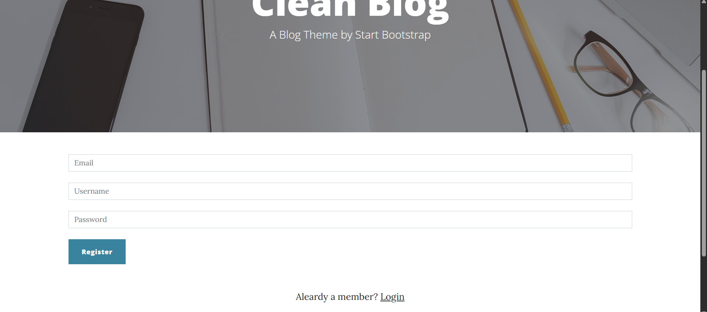

  

# 🚀 Blog Website

**Clean Blog Website** is a **responsive** and **modern blogging platform** built with **PHP** and **Bootstrap**. Inspired by the popular *Clean Blog* theme from Start Bootstrap, this project delivers a sleek and user-friendly interface for readers alongside a powerful backend for managing content effortlessly.

---

## 📝 Features

- **Responsive Design**  
  Optimized for desktops, tablets, and mobile devices for a seamless reading experience anywhere.

- **User Authentication**  
  Secure login and registration system for authors and administrators.

- **Admin Panel**  
  Intuitive dashboard to manage posts, categories, and users efficiently.

- **Search Functionality**  
  Quickly find posts by keywords to enhance navigation.

- **Category Management**  
  Organize blog posts into categories for better content discovery.

- **Contact Form**  
  Enable readers to easily reach site administrators with queries or feedback.

---

## 🛠️ Technologies Used

| Frontend                  | Backend        |
|---------------------------|----------------|
| HTML5, CSS3, Bootstrap    | PHP            |
| JavaScript, jQuery        | MySQL          |

---

## 📸 Blog Website Screenshots

> Key pages of the blog website interface

---

### 🏠 Home Page

  

---

### 🔐 Login Page

  

---

### 📝 Register Page

  

---

### 📞 Contact Page

  

## 📁 Project Structure

Click to expand

  
    blog-clean-blog-website/  
    ├── admin-panel/          # Admin dashboard files  
    ├── assets/               # Images and media assets  
    ├── auth/                 # Authentication scripts  
    ├── categories/           # Category management  
    ├── config/               # Configuration files  
    ├── css/                  # Stylesheets  
    ├── includes/             # Reusable components (header, footer, etc.)  
    ├── js/                   # JavaScript files  
    ├── posts/                # Blog post management  
    ├── users/                # User management  
    ├── index.php             # Main landing page  
    ├── contact.php           # Contact form page  
    ├── search.php            # Search results page  
    ├── 404.php               # Custom 404 error page  
    └── LICENSE               # License information  

---

## 📜 License

This project is licensed under the **Apache License 2.0** — see the [LICENSE](LICENSE) file for details.

---

> "The best way to predict the future is to invent it."  
> — **Alan Kay**

---

  
  
  

